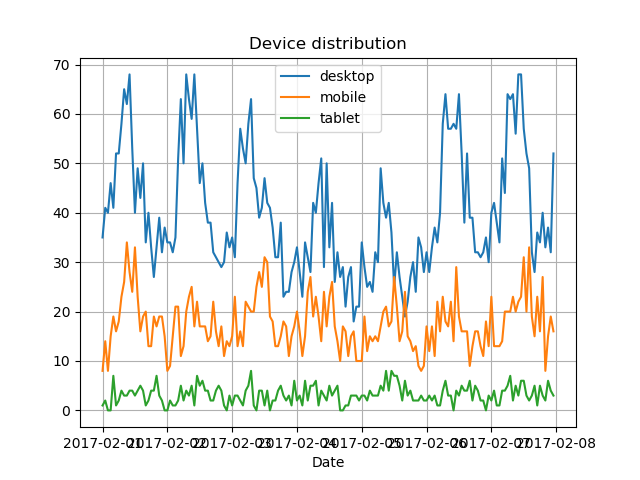
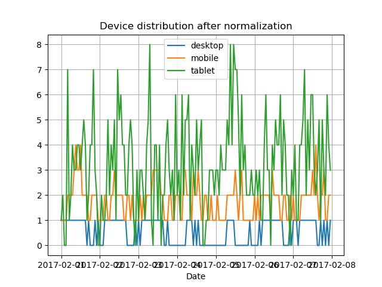
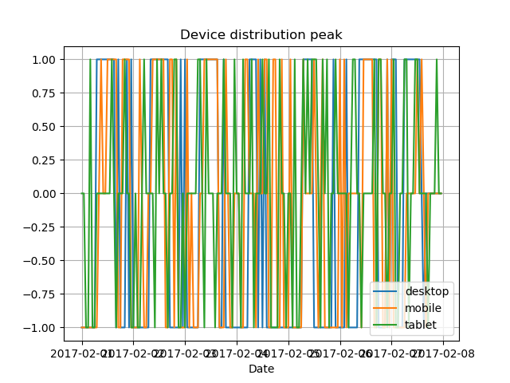
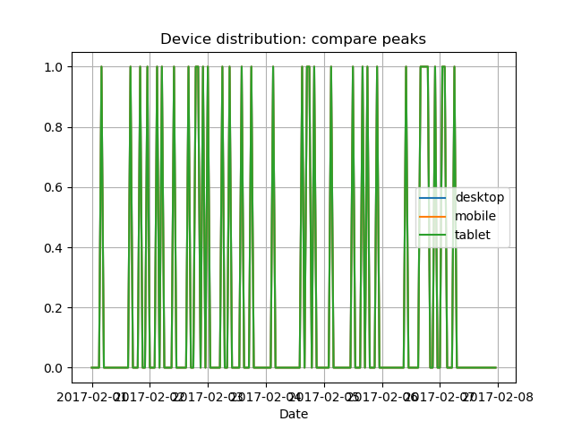

# web_analytics_lab2
**lab 2**

Файл *lab2.xlsx* містить експортовані дані(події) з Google Analytics в період з **01.02.2017** до **08.02.2017**.

Було обрано 3 категорії для порівняння: *desktop*, *mobile*, *tablet*.

Необхідні бібліотеки для виконання коду: **xlrd**, **xlwt**, **matplotlib**, **pylab**, **datetime**.

Аномалії будуть відображені в графічному вигляді.
Аномалією є відхилення від *0,00 сек* середнього часу завантаження сторінки (loadtime - DLT).
Події формуються в таблицю, сутність стовпців якої можна легко змінювати.
Задача зводиться до парсингу багатовимірного вектора, де координати вектора - це рядки в таблиці, одновимірні вектори - стовпці.

1.За допомогою **plot_distrib_dev(dev1,dev2,dev3,name)** було сформовано 3 часові ряди: синій колір - для *desktop*, оранжевий - *mobile*, зелений - *tablet*.
Результат зображений на скріншоті №1: 



2.Функція **normalization(dev)** виконує нормалізацію 3-х часових рядів до однієї шкали.
Результат на скріншоті №2:



3.**find_peak(dev1)** знаходить максимальні та мінімальні піки аномалій для 3-х типів пристроїв.
Результат на скріншоті №3:



4.**compare_peak(dev1,dev2,dev3)** показує виявлення викидів одного критерію відносно двох інших.
Результат на скріншоті №4:



5.Функція **stat()** обчислює параметри *mean*(середнє арифметичне), *var*(дисперсія - за формулою ```mean(abs(x - x.mean())**2)```), 
*std*(середньоквадратичне відхилення - за формулою ```sqrt(mean(abs(x - x.mean())**2))```), використовуючи бібліотеку *numpy*.
За допомогою **stat(cp)** отримали такі результати: *(0.20833333333333334, 0.16493055555555552, 0.4061164310337068)*

6.**dlt_deviation(n)** повертає дату і час найбільшого середньоквадратичного відхилення(*deviation*).
Отримані результати:

**2017-02-01 04:00:00**

**2017-02-01 20:00:00**

**2017-02-02 11:00:00**

**2017-02-03 07:00:00**

**2017-02-05 09:00:00**

**2017-02-05 11:00:00**

**2017-02-05 12:00:00**

**2017-02-05 13:00:00**

**2017-02-07 07:00:00**

7.**t_deviation()** знаходить кількість відхилень.

**Number of deviation:9**

8.**write_dlt(dev1,dev2,dev3)** записує в файл *dlt.xls* результати відхилення для loadtime для кожного з трьох пристроїв.
